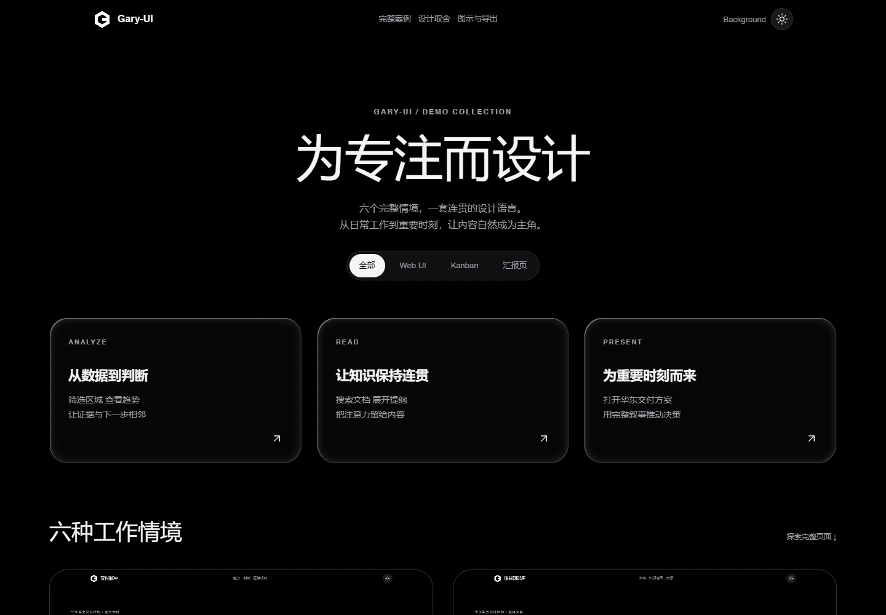

<p align="center"></p>

<h1 align="center">Gary-UI</h1>
<p align="center">为专注而设计。一个以完整情境讲解、可以复制和持续深化的 UI 设计系统。</p>
<p align="center"><a href="https://kodxixi.github.io/Gary-UI/">打开完整 Demo</a> · <a href="https://kodxixi.github.io/Gary-UI/portal/">探索设计系统</a> · <a href="#五分钟开始">复制与使用</a> · <a href="docs/ROADMAP.md">一起深化</a></p>

[](https://kodxixi.github.io/Gary-UI/)

Gary-UI 把排版、卡片、图标、图表与动效放进真实页面里：先体验它们如何一起工作，再把同一套规则带回自己的项目。默认纯黑 / 纯白、单一点网格、中文阅读尺度和克制的玻璃材质。面向人的设计说明与面向 Agent 的契约放在同一份源码中。

原创代码采用 [MIT](LICENSE)。这是持续演进的设计系统；欢迎 Fork、修改、做成自己的页面，也欢迎把具体场景和改进带回来。

## 六个页面，三种节奏

README 以 [完整 Demo 首页](examples/demos/index.html) 的六种工作情境为讲解顺序。下面的链接是可以操作的完整页面，仓库也包含对应 HTML、共享样式、固定示例数据和制图源文件。

| 情境 | 体验与设计取舍 | 在线体验 · 源码 |
| --- | --- | --- |
| **分析 · 交付脉冲** | 区域筛选、趋势、判断和证据相邻；先找到问题，再进入具体事项。 | [打开](https://kodxixi.github.io/Gary-UI/examples/demos/web-analysis/) · [HTML](examples/demos/web-analysis/index.html) |
| **阅读 · 项目知识库** | 搜索文档、连续阅读、展开提纲；正文稳定，知识地图帮助回看全局。 | [打开](https://kodxixi.github.io/Gary-UI/examples/demos/web-reading/) · [HTML](examples/demos/web-reading/index.html) |
| **分析 · 项目运行看板** | 把状态、阻断、负责人和下一动作放在一起，减少来回查找。 | [打开](https://kodxixi.github.io/Gary-UI/examples/demos/project-kanban/) · [HTML](examples/demos/project-kanban/index.html) |
| **展示 · 管理层简报** | 用大字、关键数字和有限动效建立判断顺序；静态也保留完整信息。 | [打开](https://kodxixi.github.io/Gary-UI/examples/demos/executive-board/) · [HTML](examples/demos/executive-board/index.html) |
| **阅读 · 交付决策报告** | 从摘要到量化依据，再回到来源与执行表；支持长篇阅读与打印。 | [打开](https://kodxixi.github.io/Gary-UI/examples/demos/research-report/) · [HTML](examples/demos/research-report/index.html) · [PDF](examples/demos/research-report/research-report.pdf) |
| **展示 · 华东交付方案** | 章节叙事、方案对比、交付路径与决策门；可以播放、暂停和重播。 | [打开](https://kodxixi.github.io/Gary-UI/examples/demos/proposal-presentation/) · [HTML](examples/demos/proposal-presentation/index.html) · [PDF](examples/demos/proposal-presentation/proposal-presentation.pdf) |

所有业务数字都是人工编制的演示数据。分析页仍有两项已知的数据一致性问题，详见下文。

## 这套语言如何工作

- **内容决定材质。** 正文、密集表格与指标使用稳定底板；玻璃主要服务导航、独立卡片与展示入口。文字本身不加模糊或折射。
- **操作有一致的位置。** 工具操作以 44px 圆形图标为主，导航与筛选保留文字。顶栏的 `Background` 只打开背景实验室，旁边圆形按钮独立切换深浅主题。
- **背景只做一层。** 默认单一点网格，不叠加线网和装饰等高线。背景实验由用户主动开启，本地照片和视频只在浏览器里预览。
- **鼠标光影默认关闭。** 点阵位移、卡片高光、波面视差需在 `Background` 中手动开启；减弱动态优先。
- **动效可以停下来。** 展示动效支持暂停、重播，页面不可见时停止渲染，减弱动态偏好下保留静态内容。
- **规则能追溯到代码。** 15 个组件、3 类应用模式、4 类页面模式共享 Token、样式、状态和 Agent 契约。

浏览 [Portal](https://kodxixi.github.io/Gary-UI/portal/) 查看排版、材质、组件、模板和制图；详细规则见 [DESIGN.md](DESIGN.md)。

### 图表规范与跨域验证

[图表表达规范](docs/CHART_EXPRESSION.md)提炼 **17 类图表与 7 种标注**的使用前提、尺度、排版和失败条件；[机器规则](spec/chart-recipes.json)是参数与选型真源。它把参考中的标注、对齐和阅读层次变成可迁移规则，业务字段、编号、判断与颜色语义由当前任务决定。

[图表色彩体系](docs/CHART_COLOR.md)说明类别、连续量、偏差与状态如何选色，以及深浅主题和 Apple／Google 设计原则的应用边界；角色与色值统一落在机器规则中。

[打开 demo0909.html](demo0909.html)：用不同领域的人工案例检验换单位、类别数量、尺度与缺测后的表达。[共享 SVG 参考实现](patterns/shared/chart-recipes.js)实际覆盖双轴、瀑布、环图、雷达、玫瑰五种，图表与数值表同源；不是新增适配器引擎，也不表示全部 17 类或 7 种标注已经自动实现。[调用示例与范围](docs/CHART_EXPRESSION.md#55-参考实现的调用边界)说明代码读取的参数及仍需人工审查的约束。

三种材质按场景采用：**实体底纹（Solid）**、**磨砂玻璃（Frosted）**、**超白/全透玻璃（Optical）**。实体外卡与短指标可组合 `data-gary-surface="solid" data-gary-texture="flow"`，呈现静态中性指纹细线；图表绘图区、密集表格和长正文使用干净实底。磨砂玻璃用于摘要与导航，超白/全透玻璃用于短内容与展示。联动光影默认关闭，只有在右上角 `Background` 开启后才响应；主题按钮仍独立。[适用场景、调用代码与规则](docs/VISUAL_EXPRESSION.md)。此前的[视觉研究页](examples/visual-lab/index.html)保留为历史对照。

### 可选交互示例

[打开本地实验页](examples/interaction-lab/index.html)：体验可复用的数值过渡与手动内容轮播，比较媒体轻倾斜、标题分段呈现两个候选。后两项保留实验状态，由使用者判断后再推广；完整 Demo 继续作为视觉基线。

这些配方参考 React Bits 的公开交互说明，由 Gary 独立实现，未引入其组件代码或新增依赖。[筛选依据、许可边界与复制用法](docs/INTERACTION_RECIPES.md)。

## 五分钟开始

预览只需要 **Python 3.10+**，不需要 Node.js、打包器、API Key 或外部 CDN。

```bash
git clone https://github.com/KODxixi/Gary-UI.git
cd Gary-UI
python scripts/preview.py --port 4173
```

打开 [http://127.0.0.1:4173/](http://127.0.0.1:4173/)，直接进入完整 Demo。设计系统位于 `/portal/`，模板组合位于 `/patterns/starting-points/`。

### 复制一页

1. 选择最接近你任务的完整 Demo，先在克隆的仓库里修改它。
2. 替换页面内容和 [固定示例数据](examples/demos/data/project-data.js)，复用 `tokens/`、`components/`、`patterns/shared/` 与 `examples/demos/shared/`。
3. 用 [模板组合器](https://kodxixi.github.io/Gary-UI/patterns/starting-points/) 生成更小的 HTML 起点，或直接沿用完整页的结构。
4. 交付到其他目录时一起带走所引用的共享资源，并检查相对路径。单独下载一个 HTML **不会**自动包含整个页面的 CSS、脚本、图表和图片。

### 让 Agent 使用

让 Agent 先读取你克隆目录中的 [SKILL.md](SKILL.md)，再给出真实内容和目标。可以直接复制这段提示词：

```text
请读取当前 Gary-UI 仓库的 SKILL.md、DESIGN.md，并参考 examples/demos/ 中最接近的完整页面。
为我的项目制作一个可运行的页面。先明确它属于阅读、分析还是展示情境，复用共享 Token 和组件。
保持 Background 文字入口与圆形主题按钮独立，默认只使用一层点网格。
交付 HTML、所需资源和运行说明，实际验证深浅主题、手机布局、键盘操作及主要交互。
需求明确就直接实施；只询问会改变结果的关键信息。
```

高级 Session、受管运行投影和外部 Skill 自动发现属于可选集成。普通克隆与预览不依赖维护者的 `C:\AI` 环境。

## 图表与思维导图

| 内容 | 工具与入口 |
| --- | --- |
| 架构、流程、时序、数据流和生命周期 | [Archify](adapters/visual/ARCHIFY_SKILL.md) |
| 定量分析图表 | 先按 [17 类图表规范](docs/CHART_EXPRESSION.md)选型；既有 ECharts 为常规路径，五种 [SVG 参考配方](patterns/shared/chart-recipes.js)按实际范围选用 |
| Markdown 层级思维导图 | Markmap |
| 精选信息图 | [AntV Infographic](adapters/visual/ANTV_SKILLS.md) |
| 简单流程 | Mermaid |
| 界面图标 | Lucide |

[打开制图样例](https://kodxixi.github.io/Gary-UI/examples/demos/visuals/outputs/) 可查看实际 HTML、原生源和导出。适配器保留各工具的原生格式，失败不覆盖上一份有效结果。

预览已生成的图形无需安装依赖。修改和重新生成时，需要 **Node.js 22+** 及可用的 Chromium：

```bash
npm --prefix adapters/visual ci
python scripts/gary_ui.py visual --help
```

具体命令与依赖边界见 [Visual Adapter](adapters/visual/README.md)。引擎能渲染不代表对应的专项 Skill 已安装；Archify 与 AntV 的安装/发现边界分别在上述文档中说明。

## 继续深化

欢迎从一个具体页面或操作开始贡献：附上复现步骤、预期、宽度、主题和可运行示例。共享组件的改进需要回到完整 Demo 复验，避免只修一个局部样例。

- [贡献说明](CONTRIBUTING.md)：如何提 Issue、改代码和验证。
- [路线图](docs/ROADMAP.md)：排版、布局、图标、数据与导出、图形和动效的后续方向。
- [公开版验收](docs/PUBLIC_RELEASE.md)：本次实际检查与能力边界。
- [维护与发布](docs/PUBLISHING.md)：公开克隆、母本候选与 Pages 发布的边界。
- [变更记录](CHANGELOG.md)：设计系统的演进。

当前优先关闭的两项问题：分析页切换区域后判断详情仍固定为江苏；静态图表导出不跟随当前区域筛选。它们不影响浏览设计示例，但尚不能作为真实业务数据闭环的完成证明。

## 许可证与来源

[MIT](LICENSE) 适用于 Gary-UI 原创代码与文档。第三方代码、依赖和品牌标识继续适用各自许可证，见 [第三方声明](THIRD_PARTY_NOTICES.md) 与 [完整许可证目录](licenses/third-party/)。系统字体由设备提供，仓库不打包 Apple 或其他商业字体。

Gary-UI 是独立的 Web 设计系统，与 Apple 无隶属关系。Liquid Glass 是设计参考；这里的 Web 材质实现不等同于原生系统组件。
